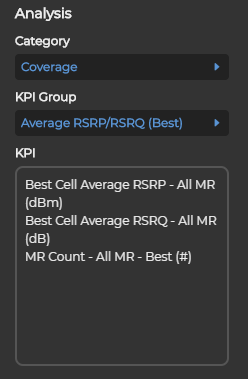

# KPI
Receive KPI data after selecting modePart

## Data structure
```javascript
    [
        {
            categoryId: 1104001,
            categoryName: "Coverage",
            categoryVisible: true,
            kpiAnalysisGroups: [
                {
                    kpiGroupId: 1204001,
                    kpiGroupName: "Average RSRP/RSRQ (Best)",
                    kpiGroupVisible: true,
                    criteriaPartId: 42100,
                    criteriaTimeConfigId: 1002,
                    criteriaScopeConfigId: 2401,
                    criteriaConditionConfigId: 0
                    kpiAnalysisList: [
                        {
                            kpiAnalysisId: 13040001
                            kpiAnalysisName: "Best Cell Average RSRP - All MR (dBm)"
                            kpiAnalysisVisible: true
                            comPartId: 1
                            comMapObjectId: 101
                            comReportObjectId: 201
                            elementUnit: "dBm"
                        }
                        ...
                    ]
                }
                ...
            ]
        }
        ...
    ]
```

## Quick Start


### Flow


## Deep Dive


### Flow


## Update criteria configs
Every KPI group has a set of criteria configs: time/scope/condition

Get supported time mode: _`/rest/criteria-service/time/getById?id=${criteriaTimeConfigId}`_

Get scope data: _`/rest/criteria-service/scope/getById?id=${criteriaScopeConfigId}`_

Get condition data: _`/rest/criteria-service/condition/getById?id=${criteriaConditionConfigId}`_