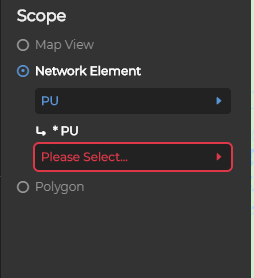
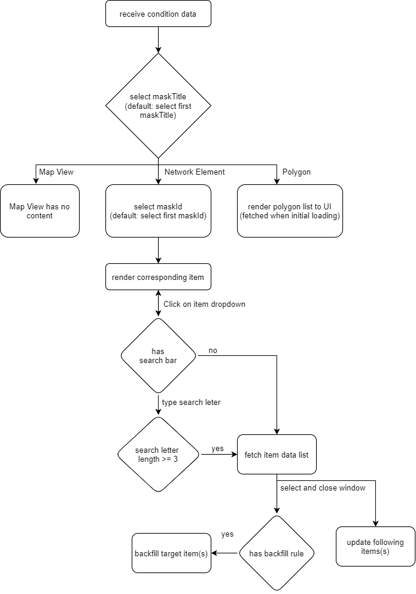

# scope


Receive scope data after selecting KPI. According to file _`/doc/api/config/config.json`_. Few properties such as 'multiLevel', 'search' ...etc, are added to item properties for later use.

## Data structure
```javascript
    {
        scope: [
            {
                groupId: 0,
                groupDisplayName: "none"
                maskTitleList: [
                    {
                        maskTitle: "Map View",
                        maskList: [
                            {
                                maskId: 9001,
                                itemList: [...]
                            }
                        ]
                    },
                    {
                        maskTite: "Network Element",
                        maskList: [
                            {
                                maskId: 4201,
                                maskDisplayName: "PU",
                                itemList: [
                                    {
                                        itemId: 4301,
                                        itemDisplayName: "PU",
                                        refTarget: "nt-service/display/tac",
                                        extraRefTarget: "NULL",
                                        extraRefCondition: "NULL",
                                        visible: true,
                                        enabled: true,
                                        urlToken: "tac"
                                    }
                                ]
                            },
                            ...
                        ]
                    },
                    {
                        maskTitle: "Polygon",
                        maskList: [
                            {
                                maskId: 9002,
                                itemList: [...]
                            }
                        ]
                    }
                ]
            }
        ]
    }
```

## flow


fetch item data list: _`/rest/${refTarget}`_