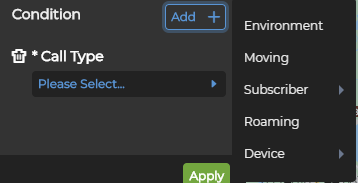
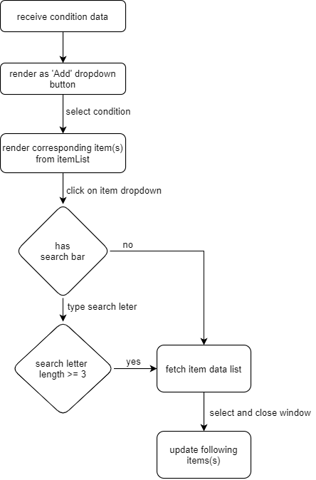

# condition


Receive condition data after selecting KPI. According to file _`/doc/api/config/config.json`_. Few properties such as 'inputBox', 'search' ...etc, are added to item properties for later use.

## Data structure
```javascript
    {
        condition: [
            {
                groupId: 1,
                groupDisplayName: "Basic"
                maskTitleList: [
                    {
                        maskTitle: "Call Type",
                        maskList: [
                            {
                                maskId: 9301,
                                itemList: [
                                    {
                                        itemId: 9301,
                                        itemTitle: "",
                                        itemDisplayName: "Call Type",
                                        refTarget: "dimension-service/display/callType",
                                        refCondition: "",
                                        extraRefCondition: "3",
                                        visible: true,
                                        enabled: true,
                                        urlToken: "callType"
                                    }
                                ]
                            }
                        ]
                    }
                    ...
                ]
            },
            {
                groupId: 2,
                groupDisplayName: "Advanced",
                maskTitleList: [
                    {
                        maskTitle: "Subscriber",
                        maskList: [
                            {
                                maskId: 9201,
                                maskDisplayName: "Subscriber Group"
                                itemList: [
                                    {
                                        itemId: 9305,
                                        itemTitle: "",
                                        itemDisplayName: "Subscriber Group",
                                        refTarget: "dimension-service/display/imsiGroup",
                                        refCondition: "",
                                        visible: true,
                                        enabled: true,
                                        urlToken: "imsiGroup"
                                    }
                                    ...
                                ]
                            }
                        ]
                        ...
                    }
                ]
            }
        ]
    }
```

## flow


fetch item data list: _`/rest/${refTarget}`_