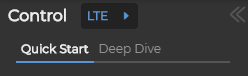
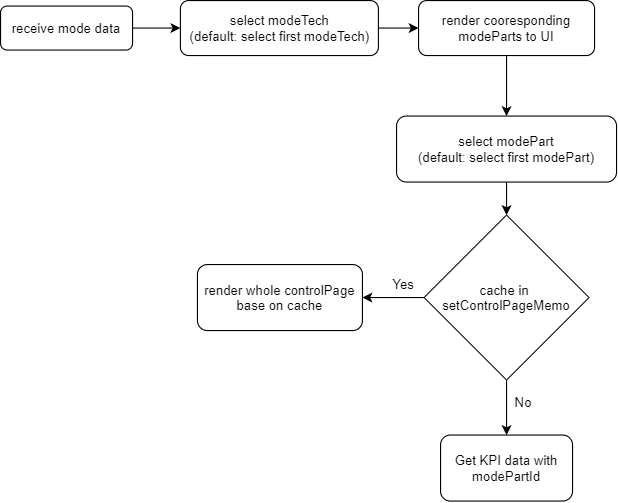

# mode


Receive mode data after app initial loading.

## Data structure
```javascript
    [
        {
            modeTechId: 4,
            techName: "LTE",
            modeParts: [
                {
                    displayName: "Quick Start",
                    modePartId: 41
                },
                {
                    displayName: "Deep Dive",
                    modePartId: 42
                }
            ]
        }
    ]
```

## Flow


Get KPI data with selected modePartId: _`/rest/initial-service/initial/kpi/${modePartId})`_

#### In addition to fetch KPI data:
Get available PU:  _`/rest/dataprovider-service/session/daily/pu`_,
 _`/rest/dataprovider-service/session/hourly/pu`_

Get available timeSetting: _`/rest/dataprovider-service/session/daily/date`_,
 _`/rest/dataprovider-service/session/hourly/date`_

 Update tech of network page: to sync with control page