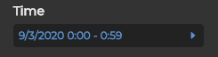
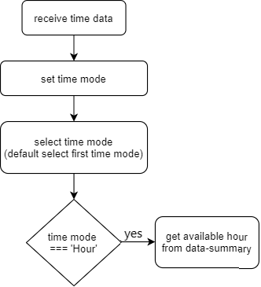

# timeSetting


Receive time data after selecting KPI

## Data structure
```javascript
    {
        time: [
            {
                gorupId: 0,
                gorupDisplayName: "none",
                maskTitleList: [
                    {
                        maskTitle: "n/a",
                        maskList: [
                            {
                                maskId: 3,
                                maskDisplayName: "Hour",
                                itemList: [
                                    {
                                        itemId: 0,
                                        itemDisplayName: "None",
                                        visible: true,
                                        enabled: true
                                    }
                                ]
                            },
                            {
                                maskId: 4,
                                maskDisplayName: "Day",
                                itemList: [
                                    {
                                        itemId: 0,
                                        itemDisplayName: "None",
                                        visible: true,
                                        enabled: true
                                    }
                                ]
                            }
                        ]
                    }
                ]
            }
        ]
    }
```

## flow


Get available hour: _`/rest/dataprovider-service/session/hourly/hour`_